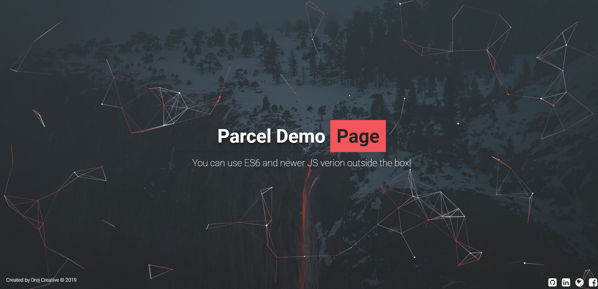

# Parcel Development setup
[Visit App](https://drejcreative.github.io/parcel-dev-setup/)

This is Parcel Development setup which has a good starting setup for website and web apps build. You can use the latest and greatest from JavaScript world as it has Babel Integrated.

> You can use CSS or SCSS or Both. It has Autoprefixer integrated. You can change Autoprefixer covering range in `package.json`.

> You can use Icon Fonts, Fonts, Images and it will work outside the box. 

> It has an integrated web server with live reload on file change.

##Install
Clone Project with `git clone https://github.com/drejcreative/parcel-dev-setup.git`
Cd into Project folder and run `npm i` for installing all npm dependencies

##Requirement
You need to install parcel first with `yarn global add parcel-bundler` or `npm i -g add parcel-bundler`

## Development server
Run `yarn run dev` for a dev server. It will automatically open your default browser and show the app. It has live reload integrated.

## Build
Run `yarn run prod` to build the project. The build artifacts will be stored in the `dist/` directory. Files are minified and ready for production.
